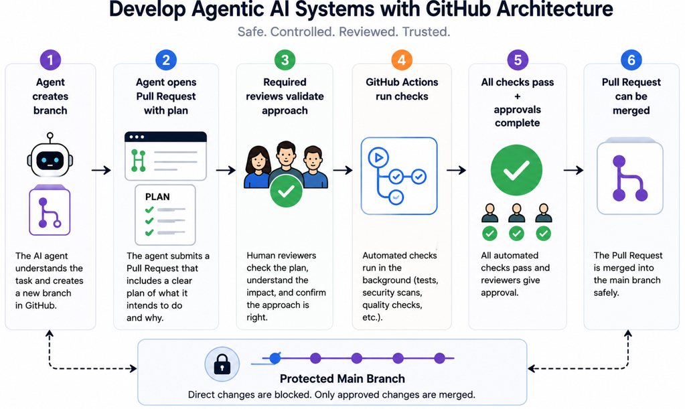

# GitHub Agentic AI Workflow Architecture

## Overview

This document describes the architecture of the GitHub Agentic AI Workflow Platform.

The platform demonstrates a secure software delivery process using GitHub Actions, Pull Request governance, AI-assisted reviews, CodeQL security scanning, Terraform validation, Dependabot automation, deployment approvals, and branch protection controls.

The architecture follows modern DevSecOps and GitOps best practices by ensuring all code changes are reviewed, validated, approved, and deployed through controlled workflows.

---

# Architecture Diagram



---

# Architecture Explanation

**Step 1:** Developer creates a feature branch.

**Step 2:** Code changes are committed locally.

**Step 3:** Changes are pushed to GitHub.

**Step 4:** A Pull Request is automatically created.

**Step 5:** Pull Request template enforces change planning.

**Step 6:** Plan Gate workflow validates required sections.

**Step 7:** PR Checks workflow executes automated testing.

**Step 8:** AI Review workflow performs automated code analysis.

**Step 9:** CodeQL performs security and code scanning.

**Step 10:** Terraform workflow validates infrastructure code.

**Step 11:** Dependabot monitors dependencies and GitHub Actions versions.

**Step 12:** Branch protection rules enforce governance policies.

**Step 13:** Required checks must pass before merging.

**Step 14:** Pull Request approvals are required.

**Step 15:** Deployment approval is required before production deployment.

**Step 16:** GitHub Actions deploy workflow executes.

**Step 17:** Production environment records deployment history.

**Step 18:** Changes are merged into the protected main branch.

---

# Architecture Components

## Developer

The developer creates feature branches, implements changes, and submits Pull Requests.

Responsibilities:

* Create feature branches
* Develop code changes
* Submit Pull Requests
* Address review feedback

---

## Pull Request Governance

All changes must be submitted through Pull Requests.

The Pull Request process provides:

* Change visibility
* Peer review
* Approval tracking
* Audit history
* Controlled merging

---

## Plan Gate Workflow

The Plan Gate workflow validates that every Pull Request contains:

* Goal
* Scope
* Implementation Steps
* Success Criteria
* Rollback Plan
* Evidence
* Review Checklist

This prevents undocumented changes from entering production.

---

## PR Checks Workflow

The PR Checks workflow validates application functionality.

The workflow automatically:

* Installs Python
* Installs dependencies
* Executes automated testing
* Validates application behavior

---

## AI Review Workflow

The AI Review workflow performs automated Pull Request analysis.

Capabilities include:

* Code review assistance
* Quality recommendations
* Best practice validation
* Change assessment

---

## CodeQL Security Scanning

CodeQL performs automated source code security analysis.

Capabilities include:

* Vulnerability detection
* Security rule enforcement
* Static code analysis
* Security findings generation

---

## Terraform Validation

Terraform validation ensures infrastructure code is syntactically correct before deployment.

The workflow:

* Initializes Terraform
* Validates Terraform configuration
* Prevents invalid infrastructure deployments

---

## Dependabot Automation

Dependabot continuously monitors dependencies and GitHub Actions versions.

Capabilities include:

* Dependency monitoring
* Security update recommendations
* Automated update Pull Requests
* Vulnerability remediation support

---

## Branch Protection Rules

The protected main branch prevents unsafe code changes.

Controls include:

* Pull Request requirement
* Required approvals
* Required status checks
* Conversation resolution
* Protected deployment workflows

---

## Deployment Approvals

Production deployments require manual approval before execution.

Benefits include:

* Human oversight
* Risk reduction
* Deployment governance
* Production change control

---

## GitHub Actions

GitHub Actions orchestrates the complete automation pipeline.

Responsibilities:

* Workflow execution
* Testing
* Security scanning
* Infrastructure validation
* Deployment automation

---

# Security Architecture

The platform implements multiple security layers:

* Pull Request Governance
* Protected Main Branch
* CodeQL Security Scanning
* Secret Scanning
* Dependabot Monitoring
* Deployment Approvals
* AI Review Validation
* Required Approvals
* Required Status Checks
* GitHub Advanced Security

---

# Architecture Workflow


---

# Architecture Workflow

```text
Developer
    ↓
Feature Branch
    ↓
Git Push
    ↓
Pull Request
    ↓
Plan Gate
    ↓
PR Checks
    ↓
AI Review
    ↓
CodeQL Scan
    ↓
Terraform Validation
    ↓
Branch Protection Validation
    ↓
Approval
    ↓
Deployment Approval
    ↓
Production Deployment
    ↓
Merge to Main
```

---

# Security Features

* Branch Protection Rules
* Pull Request Reviews
* Deployment Approvals
* CodeQL Security Scanning
* Secret Scanning
* Dependabot Alerts
* Dependency Monitoring
* AI Code Review
* Protected Main Branch
* Pull Request Governance
* Infrastructure Validation
* CI/CD Automation
* Security Advisory Integration
* Private Vulnerability Reporting
* GitHub Advanced Security
* Least Privilege Workflow Permissions

---

# Benefits

The architecture provides:

* Secure Software Delivery
* Automated Governance
* Continuous Validation
* Infrastructure Verification
* Security Scanning
* Automated Dependency Management
* Deployment Protection
* Compliance Support
* Auditability
* DevSecOps Integration

---

# Lessons Learned

* Built GitHub Actions workflows
* Implemented DevSecOps practices
* Automated Pull Request governance
* Configured deployment approvals
* Implemented CodeQL security scanning
* Integrated Dependabot automation
* Built Terraform validation pipelines
* Configured GitHub Advanced Security
* Implemented branch protection controls
* Improved CI/CD and GitOps skills
* Strengthened secure software delivery processes

---

# References

GitHub Actions Documentation

https://docs.github.com/en/actions

GitHub CodeQL Documentation

https://docs.github.com/en/code-security/code-scanning/about-code-scanning-with-codeql

Dependabot Documentation

https://docs.github.com/en/code-security/dependabot

Terraform Documentation

https://developer.hashicorp.com/terraform/docs

GitHub Branch Protection Documentation

https://docs.github.com/en/repositories/configuring-branches-and-merges-in-your-repository/managing-protected-branches

---

# Author

James Banday

GitHub: https://github.com/jbanday808/github-ai-agent/blob/main

LinkedIn: https://www.linkedin.com/in/james-allen-morta-banday-62a391128/

---
