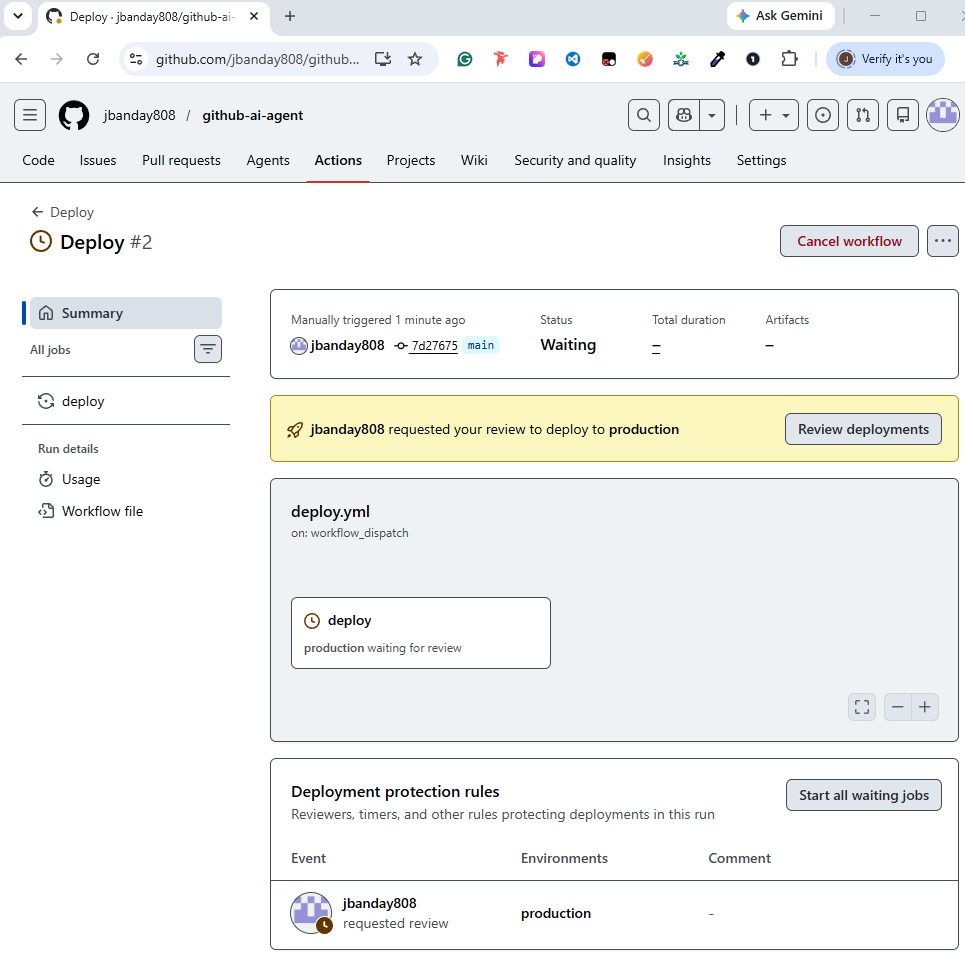
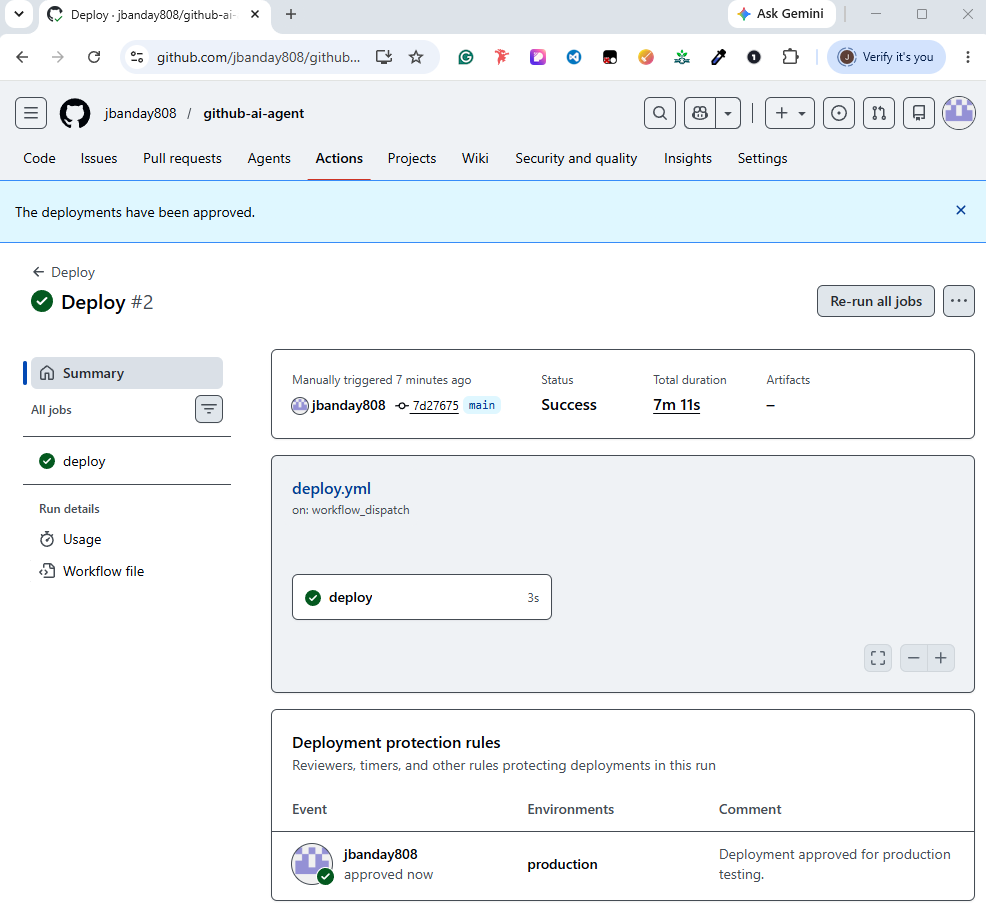

# Deployment Guide

## Overview

This guide explains how to deploy, validate, and manage the GitHub Agentic AI Workflow Platform.

The deployment process uses GitHub Actions, Terraform validation, CodeQL security scanning, AI Review workflows, deployment approvals, and branch protection controls to ensure secure software delivery.

---

# Deployment Architecture

The deployment workflow follows a controlled DevSecOps process:

```text
Developer
    ↓
Feature Branch
    ↓
Pull Request
    ↓
Plan Gate
    ↓
PR Checks
    ↓
AI Review
    ↓
CodeQL Security Scan
    ↓
Terraform Validation
    ↓
Approval Required
    ↓
Production Deployment
    ↓
Protected Main Branch
```

---

# Prerequisites

Before deployment, verify the following:

* GitHub Repository Created
* GitHub Actions Enabled
* Branch Protection Configured
* Deployment Environment Configured
* Terraform Installed
* Git Installed
* Python Installed
* GitHub Access Available

---

# Repository Setup

## Clone Repository

```bash
git clone https://github.com/jbanday808/github-ai-agent.git
```

---

## Change Directory

```bash
cd github-ai-agent
```

---

## Verify Repository

```bash
git status
```

Expected Output:

```text
On branch main
nothing to commit, working tree clean
```

---

# Create Feature Branch

## Command Overview

Command:

```bash
git checkout -b feature/new-change
```

Explanation:

* `git`: Runs Git.
* `checkout`: Switches branches.
* `-b`: Creates a new branch.
* `feature/new-change`: New feature branch name.

Summary: Creates a new feature branch for development.

---

# Make Changes

Modify source code or workflow files.

Examples:

```text
src/app.py
.github/workflows/pr-checks.yml
infra/main.tf
README.md
```

---

# Stage Changes

## Command Overview

Command:

```bash
git add .
```

Explanation:

* `git`: Runs Git.
* `add`: Stages files.
* `.`: Adds all modified files.

Summary: Stages all changes for commit.

---

# Commit Changes

## Command Overview

Command:

```bash
git commit -m "Add new feature"
```

Explanation:

* `git`: Runs Git.
* `commit`: Creates a commit.
* `-m`: Adds a message.
* `"Add new feature"`: Commit description.

Summary: Saves changes into Git history.

---

# Push Changes

## Command Overview

Command:

```bash
git push -u origin feature/new-change
```

Explanation:

* `git`: Runs Git.
* `push`: Uploads changes.
* `-u`: Sets upstream tracking.
* `origin`: Remote repository.
* `feature/new-change`: Branch name.

Summary: Pushes the feature branch to GitHub.

---

# Create Pull Request

After pushing code:

1. Open GitHub Repository
2. Select Pull Requests
3. Click New Pull Request
4. Select Feature Branch
5. Complete Pull Request Template
6. Submit Pull Request

---

# Automated Validation

After creating a Pull Request, GitHub Actions automatically starts validation workflows.

---

## Plan Gate

Validates:

* Goal
* Scope
* Steps
* Success Criteria
* Rollback Plan
* Evidence
* Review Checklist

---

## PR Checks

Runs:

```bash
pytest
```

Purpose:

* Validate application functionality
* Prevent broken code merges

---

## AI Review

Automatically reviews:

* Code quality
* Pull Request content
* Security concerns
* Best practices

---

## CodeQL

Performs:

* Static code analysis
* Security scanning
* Vulnerability detection
* Secure coding validation

---

## Terraform Validation

Runs:

```bash
terraform init
terraform validate
```

Purpose:

* Validate infrastructure code
* Prevent deployment failures

---

# Verify Workflow Status

Navigate to:

```text
GitHub Repository
    ↓
Actions
```

Verify successful execution of:

* Plan Gate
* PR Checks
* AI Review
* CodeQL
* Terraform

---

# Deployment Approval Process
## Deployment Waiting for Approval



Production deployments require manual approval.

Workflow:

```text
Workflow Started
        ↓
Waiting for Approval
        ↓
Reviewer Approval
        ↓
Production Deployment
```

This prevents unauthorized deployments.

---

# Approve Deployment

Navigate to:

```text
GitHub Repository
    ↓
Actions
    ↓
Deploy Workflow
    ↓
Review Deployments
```

Select:

```text
Approve and Deploy
```

---

# Verify Deployment

Navigate to:

```text
GitHub Repository
    ↓
Actions
    ↓
Deploy
```

Verify:

```text
Status: Success
```

Expected Result:

```text
Deployment approved for production
```
---

## Deployment Approval Completed



---

# Merge Pull Request

After:

* Plan Gate Passed
* PR Checks Passed
* AI Review Completed
* CodeQL Passed
* Terraform Passed
* Deployment Approved

Merge the Pull Request.

Expected Result:

```text
Merged into main
```

---

# Branch Protection Validation

Verify branch protection is enforced.

Navigate to:

```text
Settings
    ↓
Branches
    ↓
Branch Protection Rules
```

Verify:

* Require Pull Requests
* Require Approvals
* Require Status Checks
* Require Conversation Resolution
* Block Force Pushes

---

# Validation Commands

## Verify Branch

```bash
git branch
```

---

## Verify Status

```bash
git status
```

---

## Verify Remote

```bash
git remote -v
```

---

## Verify Workflow Files

```bash
tree -a .github
```

---

## Verify Terraform

```bash
terraform validate
```

---

# Deployment Rollback

If deployment issues occur:

## Revert Commit

```bash
git revert <commit-id>
```

---

## Push Revert

```bash
git push origin main
```

---

## Create New Pull Request

Submit a Pull Request containing rollback changes.

The same validation workflows will execute before deployment.

---

# Security Controls During Deployment

The deployment process includes:

* Pull Request Validation
* Branch Protection
* AI Review
* CodeQL Scanning
* Terraform Validation
* Deployment Approvals
* Secret Scanning
* Dependabot Monitoring
* Protected Environments
* Audit Logging

---

# Lessons Learned

* Built GitHub Actions deployment pipelines
* Implemented deployment approvals
* Configured branch protection
* Integrated CodeQL scanning
* Automated Pull Request governance
* Implemented DevSecOps workflows
* Validated Terraform infrastructure
* Improved CI/CD deployment processes
* Strengthened software delivery security
* Improved GitHub administration skills

---

# References

GitHub Actions Documentation: This guide provides detailed instructions on creating and automating CI/CD workflows using GitHub Actions.

https://docs.github.com/en/actions

GitHub Environments Documentation: This guide explains deployment approvals and protected environments.

https://docs.github.com/en/actions/deployment/targeting-different-environments/using-environments-for-deployment

Terraform Documentation: This guide provides detailed instructions on infrastructure validation and deployment.

https://developer.hashicorp.com/terraform/docs

GitHub Branch Protection Documentation: This guide explains how to secure repositories using branch protection rules.

https://docs.github.com/en/repositories/configuring-branches-and-merges-in-your-repository/managing-protected-branches

---

# Author

James Banday

GitHub: https://github.com/jbanday808/github-ai-agent

LinkedIn: https://www.linkedin.com/in/james-allen-morta-banday-62a391128/

---
