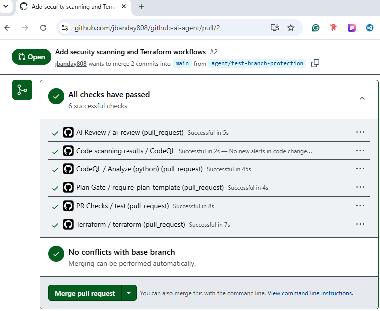

# Security Controls

## Overview

This document describes the security controls implemented within the GitHub Agentic AI Workflow Platform.

The platform follows DevSecOps, GitOps, and Secure Software Development Lifecycle (SSDLC) best practices by integrating automated security validation, governance controls, deployment approvals, dependency monitoring, code scanning, and protected branch enforcement.

---

# Security Architecture

The security model follows a layered defense approach:

```text
Developer
    ↓
Feature Branch
    ↓
Pull Request
    ↓
Plan Validation
    ↓
Automated Testing
    ↓
AI Review
    ↓
CodeQL Security Scan
    ↓
Terraform Validation
    ↓
Approval Workflow
    ↓
Deployment Approval
    ↓
Protected Main Branch
```

---

# Security Objectives

The platform is designed to:

* Prevent unauthorized code changes
* Detect security vulnerabilities
* Enforce Pull Request governance
* Protect production deployments
* Validate infrastructure code
* Monitor dependency risks
* Improve software quality
* Strengthen DevSecOps practices

---

# Branch Protection Controls

The main branch is protected using GitHub Branch Protection Rules.

---

## Security Features

The protected branch requires:

* Pull Requests
* Status Checks
* Reviewer Approvals
* Conversation Resolution
* Deployment Validation
* Successful Security Scans

---

## Protection Benefits

These controls help:

* Prevent direct commits
* Prevent accidental changes
* Improve change visibility
* Enforce peer review
* Reduce deployment risk

---

# Pull Request Governance

All changes must be submitted through Pull Requests.

---

## Pull Request Requirements

Each Pull Request must include:

* Goal
* Scope
* Steps
* Success Criteria
* Rollback Plan
* Evidence
* Review Checklist

---

## Security Benefits

Pull Request governance:

* Documents changes
* Improves accountability
* Supports auditing
* Prevents undocumented modifications

---

# Plan Gate Workflow

The Plan Gate workflow validates Pull Request documentation.

---

## Validation Checks

The workflow verifies:

* Goal exists
* Scope exists
* Steps exist
* Success Criteria exists
* Rollback Plan exists
* Evidence exists
* Review Checklist exists

---

## Security Benefits

Plan validation:

* Improves change management
* Supports audit readiness
* Reduces operational risk
* Enforces governance standards

---

# PR Checks Workflow

The PR Checks workflow performs automated testing.

---

## Security Functions

The workflow:

* Executes tests
* Verifies code functionality
* Detects failures
* Prevents broken code deployment

---

## Example Command

```bash
pytest
```

---

# AI Review Controls

The AI Review workflow performs automated code analysis.

---

## AI Review Functions

The workflow:

* Reviews Pull Requests
* Evaluates code quality
* Detects potential issues
* Provides recommendations

---

## Security Benefits

AI-assisted review:

* Improves code quality
* Detects common issues
* Supports secure development
* Enhances review efficiency

---

# CodeQL Security Scanning

GitHub CodeQL provides Static Application Security Testing (SAST).

---

## CodeQL Functions

The workflow:

* Scans source code
* Detects vulnerabilities
* Identifies insecure coding patterns
* Generates security findings

---

## Example Security Categories

CodeQL can detect:

* Injection vulnerabilities
* Insecure authentication
* Hardcoded credentials
* Unsafe code patterns
* Data exposure risks

---

## Security Benefits

CodeQL helps:

* Improve application security
* Reduce vulnerabilities
* Identify coding risks
* Strengthen software quality

---

# Secret Scanning

GitHub Secret Scanning detects exposed secrets.

---

## Monitored Items

Examples include:

* API Keys
* Access Tokens
* Cloud Credentials
* Passwords
* Private Keys

---

## Security Benefits

Secret Scanning:

* Prevents credential exposure
* Reduces compromise risk
* Improves repository security

---

# Push Protection

Push Protection blocks commits containing secrets.

---

## Protection Workflow

```text
Developer Commit
        ↓
Secret Detection
        ↓
Commit Blocked
        ↓
Secret Removed
        ↓
Commit Allowed
```

---

## Security Benefits

Push Protection:

* Prevents accidental exposure
* Stops credential leaks
* Improves repository security

---

# Dependabot Security Controls

Dependabot continuously monitors dependencies.

---

## Dependabot Functions

Dependabot:

* Detects vulnerable packages
* Creates update Pull Requests
* Updates GitHub Actions
* Tracks dependency risks

---

## Security Benefits

Dependabot helps:

* Reduce supply chain risks
* Improve patch management
* Maintain secure dependencies

---

# Terraform Validation Controls

Terraform validation protects infrastructure deployments.

---

## Validation Process

Terraform automatically verifies:

* Syntax
* Configuration
* Resource Definitions
* Infrastructure Integrity

---

## Example Commands

```bash
terraform init
terraform validate
```

---

## Security Benefits

Terraform validation:

* Prevents invalid deployments
* Reduces infrastructure errors
* Supports Infrastructure as Code security

---

# Deployment Approval Controls

Production deployments require approval.

---

## Approval Workflow

```text
Deployment Request
         ↓
Pending Review
         ↓
Approval Required
         ↓
Deployment Allowed
```

---

## Security Benefits

Deployment approvals:

* Prevent unauthorized releases
* Reduce production risk
* Improve operational control

---

# GitHub Environment Protection

Production deployments use protected environments.

---

## Environment Controls

Protected environments support:

* Deployment Approvals
* Required Reviewers
* Deployment History
* Audit Logging

---

## Security Benefits

Environment protection:

* Improves deployment security
* Supports governance
* Enhances accountability

---

# GitHub Advanced Security

GitHub Advanced Security provides centralized security monitoring.

---

## Security Components

* CodeQL
* Secret Scanning
* Dependabot
* Security Advisories
* Vulnerability Reporting

---

## Security Benefits

Advanced Security:

* Improves visibility
* Strengthens monitoring
* Supports vulnerability management

---

# Private Vulnerability Reporting

GitHub allows private security issue reporting.

---

## Benefits

* Responsible disclosure
* Secure communication
* Improved vulnerability handling
* Better remediation processes

---

# Security Monitoring

The platform continuously monitors:

* Pull Requests
* Code Changes
* Security Findings
* Dependency Updates
* Deployment Activity
* Branch Protection Events

---

# Security Validation Checklist

Verify the following controls:

* Branch Protection Enabled
* Pull Requests Required
* Approvals Required
* CodeQL Enabled
* Secret Scanning Enabled
* Push Protection Enabled
* Dependabot Enabled
* Deployment Approvals Enabled
* Terraform Validation Enabled
* AI Review Enabled

## Pull Request Validation



---

# Security Compliance Benefits

The platform aligns with common security principles:

* Least Privilege
* Separation of Duties
* Change Management
* Secure Development
* Continuous Monitoring
* Infrastructure as Code
* DevSecOps
* GitOps Governance

---

# Lessons Learned

* Implemented secure Pull Request workflows
* Configured branch protection controls
* Integrated CodeQL security scanning
* Enabled Secret Scanning and Push Protection
* Automated dependency monitoring
* Implemented deployment approvals
* Improved software governance
* Strengthened DevSecOps practices
* Reduced deployment risk
* Improved security visibility

---

# References

GitHub Advanced Security Documentation: This guide provides instructions for code scanning, secret scanning, and security monitoring.

https://docs.github.com/en/get-started/learning-about-github/about-github-advanced-security

GitHub CodeQL Documentation: This guide explains how to perform security analysis and vulnerability scanning using CodeQL.

https://docs.github.com/en/code-security/code-scanning/introduction-to-code-scanning/about-code-scanning-with-codeql

GitHub Secret Scanning Documentation: This guide explains how GitHub detects exposed credentials and secrets.

https://docs.github.com/en/code-security/secret-scanning/about-secret-scanning

GitHub Dependabot Documentation: This guide provides instructions on managing dependency updates and vulnerability remediation.

https://docs.github.com/en/code-security/dependabot

GitHub Branch Protection Documentation: This guide explains how to secure repositories using branch protection rules.

https://docs.github.com/en/repositories/configuring-branches-and-merges-in-your-repository/managing-protected-branches

GitHub Environments Documentation: This guide explains deployment approvals and protected environments.

https://docs.github.com/en/actions/deployment/targeting-different-environments/using-environments-for-deployment

---

# Author

James Banday

GitHub: https://github.com/jbanday808/github-ai-agent

LinkedIn: https://www.linkedin.com/in/james-allen-morta-banday-62a391128/

---
